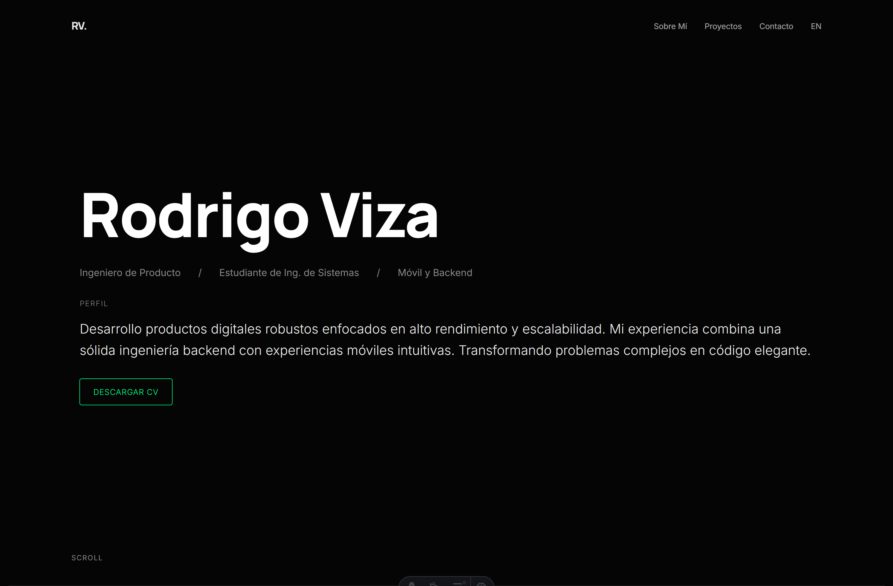

# 🚀 Rodrigo Viza | Portfolio

Portfolio personal moderno y minimalista de desarrollador, construido con Astro. Presenta proyectos destacados, stack tecnológico y múltiples formas de contacto.



## ✨ Características

- **Diseño Dark Mode Premium** - Estética oscura con acentos neon verdes
- **Internacionalización (i18n)** - Español e Inglés con routing nativo de Astro
- **Animaciones Interactivas** - Efectos de scroll reveal y hover con glow
- **Carrusel de Imágenes** - Showcase de proyectos con navegación fluida
- **Skills con Colores Dinámicos** - Chips animados con pulse por categoría
- **Iconos Sociales de Marca** - WhatsApp, LinkedIn, GitHub, Email, X con colores oficiales
- **Totalmente Responsive** - Optimizado para móvil, tablet y desktop
- **Rendimiento Optimizado** - Carga rápida con lazy loading de imágenes

## 🛠️ Stack Tecnológico

- **Framework**: [Astro](https://astro.build/)
- **Estilos**: CSS Variables + Animaciones nativas
- **Fuentes**: Manrope (Headings) + Inter (Body) via Google Fonts
- **Hosting**: Listo para Vercel/Netlify

## 📁 Estructura del Proyecto

```text
/
├── public/
│   └── projects/          # Imágenes de proyectos
├── src/
│   ├── components/
│   │   ├── ProjectItem.astro    # Tarjeta de proyecto con carrusel
│   │   └── ProjectList.astro    # Lista de proyectos
│   ├── data/
│   │   └── projects.ts          # Datos de proyectos
│   ├── i18n/
│   │   └── translations.ts      # Traducciones ES/EN
│   ├── layouts/
│   │   └── Layout.astro         # Layout principal con header, footer y estilos globales
│   └── pages/
│       ├── index.astro          # Redirect
│       ├── en/index.astro       # Página en Inglés
│       └── es/index.astro       # Página en Español
└── package.json
```

## 🎨 Proyectos Destacados

| Proyecto              | Descripción                         | Tecnologías                       |
| --------------------- | ----------------------------------- | --------------------------------- |
| **SneakerShooes**     | E-commerce de zapatillas full-stack | Next.js, TypeScript, React        |
| **AQP Explorer**      | App móvil de turismo offline-first  | Kotlin, Jetpack Compose, Firebase |
| **LEXIA**             | Plataforma EdTech con IA para niños | Next.js, Python, FastAPI          |
| **GlassFish AppShop** | Sistema empresarial Java EE         | Java, Jakarta EE, JSP             |

## 🧞 Comandos

| Comando        | Acción                               |
| -------------- | ------------------------------------ |
| `pnpm install` | Instala dependencias                 |
| `pnpm dev`     | Inicia servidor en `localhost:4321`  |
| `pnpm build`   | Compila para producción en `./dist/` |
| `pnpm preview` | Preview de la build                  |

## 📬 Contacto

- **Email**: rodrigoestefanovizacuti@gmail.com
- **Teléfono**: +51 959 619 405
- **LinkedIn**: [rodrigoviza](https://www.linkedin.com/in/rodrigoviza/)
- **GitHub**: [imlosing07](https://github.com/imlosing07)
- **X/Twitter**: [RodrigoViza4](https://x.com/RodrigoViza4)

## 📄 Licencia

© 2025 Rodrigo Viza. Todos los derechos reservados.

---

Hecho con ❤️ y [Astro](https://astro.build)
